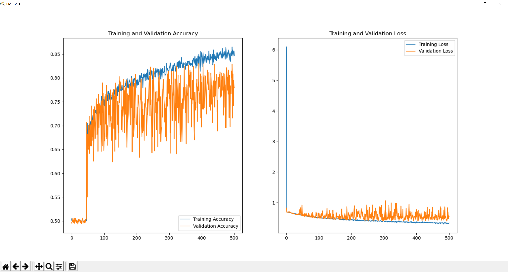

# Fake News Detection and Colour Detection

* [Fake news detection](#fake-news-detection) using scikit-learn 
* [Colour detection](#colour-detection) using OpenCV

## Fake News Detection

Trains classifier from fake news data and reports testing accuracy. The code is at [src/fakeNews](src/fakeNews) and the main file is [src/fakeNews/fakeNews.py](src/fakeNews/fakeNews.py).

### Prerequisites

The following Python libraries are required

* scikit-learn
* pandas

### Running

* Navigate to the directory with ```cd src``` and ```cd fakeNews```

* Run ```python fakeNews.py``` to train a classifier on fake news data. It will report the confusion matrix, accuracy, precision, recall, and f1 score.


## Colour Detection

Displays colours name and RGB values of clicked pixels. The code is at [src/colourDetection](src/colourDetection) and the main file is [src/colourDetection/colourDetection.py](src/colourDetection/colourDetection.py).

### Prerequisites

The following Python libraries are required

* OpenCV
* pandas

### Running

* Navigate to the directory with ```cd src``` and ```cd colourDetection```

* Run ```python colourDetection.py ``` to open up an image. Double click to display the RGB values and name of closest colour. Press esc to exit.


## License

This project is licensed under the MIT License - see the [LICENSE](LICENSE) file for details
# Deep Neural Networks

Image classification using [deep convolutional neural networks (CNN)](src/CNN). Work in progress. Main file is [deepNetwork.py](src/CNN/deepNetwork.py).

### Data Augmentation


### Model Summary


### Model Visualization


### Model Performance



## Previous work 
* Deep neural network with [TensorFlow implementation](src/tfNetwork). Main file is [deepNetwork.py](src/tfNetwork/deepNetwork.py).
* Deep neural network with [NumPy implementation](src/npNetwork). Main file is [deepNetwork.py](src/npNetwork/deepNetwork.py).
