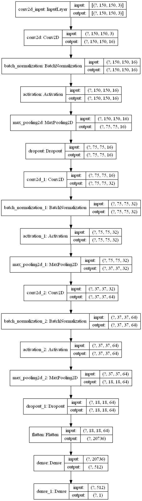

# Deep Neural Networks

Image classification using [deep convolutional neural networks (CNN)](src/CNN). Work in progress. Main file is [deepNetwork.py](src/CNN/deepNetwork.py).

### Data Augmentation

### Model Summary

### Model Visualization

### Model Performance

## Previous work 
* Deep neural network with [TensorFlow implementation](src/tfNetwork). Main file is [deepNetwork.py](src/tfNetwork/deepNetwork.py).
* Deep neural network with [NumPy implementation](src/npNetwork). Main file is [deepNetwork.py](src/npNetwork/deepNetwork.py).
